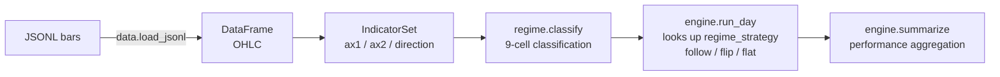

[🇯🇵 日本語](README.md) | [🇬🇧 English](README.en.md)

# bt-dynamic

[](https://github.com/yktsnet/bt-dynamic/actions/workflows/ci.yml)

A backtesting engine for dynamic regime switching. It classifies the market into a 9-cell grid (trend strength × volatility, three levels each) over short time windows, and implements a single hypothesis — switching between trend-following (follow), counter-trend (flip), and no-position (None) per cell — end to end, from classification through decision-making to verification.

Static backtesting (fixing a strategy based on past performance) collapses when the market regime changes. This repository's method is to confine dynamic switching — the counter to that problem — inside a deliberately small, fixed 9-cell frame. Because the frame is small, a human can compare it across seasonal and yearly windows, and the judgment loop works: only cells that survive multiple periods get promoted to live trading. **The production values of the cell mapping table, actual threshold numbers, performance results, and currency pairs are not published.** All of these are injected externally via configuration JSON and simply do not exist in the package or the repository (see [Scope](#scope) for where the line is drawn).


(The demo uses synthetic data × an explanatory dummy config. Regenerate it with `nix-shell -p vhs jq "python3.withPackages(ps: with ps; [pandas numpy])" --run 'vhs examples/trend/demo.tape'`)

## Quick Start

```bash
pip install bt-dynamic

# Just want to see it move? Use the bundled synthetic sample
bt-dynamic --config examples/trend/config.json --data examples/trend/data/sample_m5.jsonl
```

The standard usage is to fetch your own real data and run against it (the repository does not bundle any data; see [docs/fetch-data.md](docs/fetch-data.md) for fetch instructions).

```bash
# Fetch 1h bars (no API key required) and convert
npx dukascopy-node -i eurusd -from 2025-01-01 -to 2025-03-31 -t h1 -f json
bt-dynamic-convert download/eurusd-h1-*.json -o bars.jsonl

# Run the backtest
bt-dynamic --config my-config.json --data bars.jsonl
```

- `--config`: JSON holding parameters and the cell mapping table (`regime_strategy`). Can also be set via `$BT_DYNAMIC_CONFIG`
- `--data`: JSONL bar data (`time_utc` / `open` / `high` / `low` / `close`)
- `--dynamic`: derive thresholds dynamically from recent trading-day percentiles instead of using fixed values

## Architecture



`cli.py` is the layer that wires the above together. `Config.load()` injects the mapping table and thresholds externally, and `--indicators` / `--param` let you swap out indicators and parameters. Throughout this flow, `src/bt_dynamic/` never imports `examples/` or the production-side repository — the dependency runs one way only.

## Tech Stack

| Layer | Technology | Reason |
|---|---|---|
| Distribution | PyPI (hatchling build) | the live execution layer already exists as a real consumer that embeds the core via pip, so registry distribution is required. The absence of any mapping-table values inside the wheel is structural proof of separation |
| Data processing | pandas / numpy | Expressive enough for per-bar indicator calculation and vectorized processing. Covers ADX/ATR/RSI without any additional numerical library |
| CLI | argparse (standard library) | The design favors file swapping over an interactive wizard; argparse implements `--param` / `--indicators` overrides with no extra dependency |
| Config injection | JSON + environment variable (`BT_DYNAMIC_CONFIG`) | An externally-injected format that protects the mapping table and thresholds through "structural separation" rather than "obfuscation." Ensures no production value exists in the code or the repository |
| Data acquisition | dukascopy-node (external CLI, not a dependency) | The primary route for fetching 1h bars with no API key and no cost. The fetch code is distributed, but the data itself is never bundled or redistributed |
| Testing | pytest | Unit test layout that mirrors `src/` one to one |

## Iterate by swapping pieces

The core workflow of this tool is a loop: swap indicators and parameters, look at the results, run again.

**Parameters** can be overridden via arguments without editing the JSON:

```bash
bt-dynamic --config c.json --data bars.jsonl --param tp_pips=15 --param ax1_weak=20
```

**Indicators** are swapped by passing a Python file that exposes an `IndicatorSet`:

```bash
bt-dynamic --config c.json --data bars.jsonl --indicators my_strategy/indicators.py
```

```python
# my_strategy/indicators.py
from bt_dynamic import IndicatorSet

INDICATORS = IndicatorSet(
    compute_ax1=my_trend_strength,   # axis 1: trend strength
    compute_ax2=my_volatility,       # axis 2: volatility
    compute_direction=my_oscillator, # directional bias (a centered oscillator)
)
```

**Narrowing to specific cells** via `--cells` (unspecified cells are treated as no-position):

```bash
bt-dynamic --config c.json --data bars.jsonl --cells 2,1 2,2
```

**"Why didn't it enter here?"** — `--debug` dumps every decision point (a classifier view that ignores position state):

```bash
bt-dynamic --config c.json --data bars.jsonl --start 2025-01-09 --days 1 --debug
```

`--data` accepts multiple files (pass data split by day or year as-is):

```bash
bt-dynamic --config c.json --data bars/2025-*.jsonl
```

**Comparing results**: `--json` emits a machine-readable summary you can line up however you like:

```bash
bt-dynamic --config c.json --data bars.jsonl --param tp_pips=15 --json >> runs.jsonl
bt-dynamic --config c.json --data bars.jsonl --param tp_pips=30 --json >> runs.jsonl
jq '{tp: .meta.param_overrides.tp_pips, total: .summary.total_pips}' runs.jsonl
```

## Adding a strategy

One strategy = one directory. The standard way to add one is to copy `examples/trend/` and swap the contents.

```
my_strategies/
  breakout/
    config.json     # this strategy's cell mapping and thresholds
    indicators.py   # INDICATORS = IndicatorSet(...) (unnecessary if using the default indicators)
  meanrev/
    config.json
```

```bash
bt-dynamic --config my_strategies/breakout/config.json --indicators my_strategies/breakout/indicators.py --data bars.jsonl
```

The engine (this package) is never touched. The strategy's substance lives only in your own files.

## Python API

```python
from bt_dynamic import Config, load_jsonl, run_day, summarize

config = Config.load("your-config.json")
df = load_jsonl("your-bars.jsonl")
trades = run_day(df, "2025-01-07", config)
summarize(trades)
```

## The 9-cell framework

Three indicators are each classified into three levels (0/1/2), and two of the axes combine to form a 9-cell grid. The third axis (the directional indicator) returns BUY / SELL / None, and the mode assigned to each cell decides whether to enter.

| | Low vol (0) | Normal (1) | High vol (2) |
|---|---|---|---|
| **Weak trend (0)** | follow / flip / None | ″ | ″ |
| **Medium trend (1)** | ″ | ″ | ″ |
| **Strong trend (2)** | ″ | ″ | ″ |

Which mode gets assigned to which cell is "the answer," and that is injected via configuration JSON. What's in `examples/trend/config.json` is an explanatory textbook-style dummy (strong trend → follow, weak trend → flip) — it is neither a recommendation nor a production value.

## Design Decisions

See [docs/design-decisions.md](docs/design-decisions.md) for the full write-up of each decision.

- **Deliberately fix a small 9-cell frame** — the finer the classification, the less of the verification fits in a human head. Rather than the best classification, fix one that is small enough for comparison and judgment to work, then search for the optimum under that constraint. The boundaries never move either — moving them invalidates every past comparison. When the frame needs fixing, build another light frame instead
- **Cells are selected by survival, not performance** — run seasonal and yearly windows and promote only the cells that stayed positive across multiple periods. A single good result never promotes, and a change that improves the total but breaks one window gets reverted
- **Unresolved stays unresolved** — cells that never work, seasonal losses, and performance decay are kept on a ledger, neither finalized nor discarded. Whether a decay is temporary or structural is not decided until enough observation accumulates
- **Entry is the next bar's open, one bar shifted** — this kills lookahead bias and simultaneously matches live fill conditions, where a bar is not final the instant it ends. The engine also owns the forced end-of-session close, keeping overnight P/L out of the verification
- **The engine only knows abstract axes (ax1/ax2/direction)** — ADX/ATR/RSI are swappable default indicators. This abstraction is the precondition that makes `--indicators` swapping possible
- **Mapping table and parameters load from one config JSON, explicitly** — no implicit loading at import time, no per-parameter env injection (it scatters configuration). The core never imports the strategy side; the dependency runs one way
- **Swapping is done via CLI arguments and files, not an interactive wizard** — the target users can write Python, and the loop of swapping indicators/parameters and iterating is the tool's core value proposition
- **No dedicated comparison scripts — generalized into `--json` output instead** — grow a dedicated script per hypothesis and the comparison code outpaces the thing being verified
- **No lot concept** — mix sizing into the decisions and the quality of the decision and the quality of the money management blur into one number. The engine sticks to reporting flat-lot pips; sizing belongs to the live execution layer

## Scope

**Focus**

- A single-hypothesis, end-to-end implementation: 9-cell dynamic regime classification → follow/flip/flat decision → daily backtest → performance aggregation
- Directory-level separation between the generic backtesting core (`src/bt_dynamic/`) and the domain application example (`examples/trend/`)
- Structural separation of core and edge through external injection of indicators, parameters, and the mapping table

**Out of Scope (the line between public and private)**

The framework (9 cells, dynamic thresholds, ADX/ATR/RSI) is a general quant concept and not the edge. The edge is the answer to "in which market condition does trend-following/counter-trend work" — the actual contents of the `regime_strategy` mapping table, the real threshold numbers, performance results, and currency pairs.

| | Content |
|---|---|
| Published (the question) | Why dynamic regime switching (avoiding the collapse that static backtesting causes) |
| Published (the method) | 9-cell classification, follow/flip, the methodology of falsifying a hypothesis through comparison (comparing `--json` output), separation of research from production, config file (JSON) design |
| Not published (the answer) | Production values of `regime_strategy`, real threshold numbers, TP/SL, performance results, currency pairs |

Strategies are kept to the single `examples/trend/` one (multi-strategy comparison features and an interactive strategy-adding wizard are out of scope; use the file-copy workflow described in [Adding a strategy](#adding-a-strategy) instead).

## Development

```bash
pip install -e . --group dev
pytest
```

The synthetic data in `examples/trend/` can be regenerated with `python examples/trend/generate_data.py` (a seeded random walk, not real data).

## License

MIT
