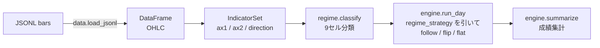

[🇯🇵 日本語](README.md) | [🇬🇧 English](README.en.md)

# bt-dynamic

[](https://github.com/yktsnet/bt-dynamic/actions/workflows/ci.yml)

動的レジーム切替のバックテストエンジン。相場を短い時間窓で 9 セル（トレンド強度 × ボラティリティ、各 3 段階）に分類し、セルごとに順張り（follow）/ 逆張り（flip）/ ノーポジ（None）を切り替える単一仮説を、分類 → 判定 → 検証まで通して実装する。

静的バックテスト（過去成績で戦略を固定する）は相場環境が変われば共倒れする。その対抗としての動的切替を、あえて 9 セルという小さな固定フレームに閉じ込めるのが本リポの作法である。フレームが小さいから人間が季節・年の窓で比較でき、複数期間を生き残ったセルだけを運用に昇格させる、という判断が回る。**セル対応表の本番値・閾値の実数・成績・通貨ペアは公開しない**。それらはすべて設定 JSON の外部注入であり、パッケージにもリポにもそもそも存在しない（線引きは [Scope](#scope) を参照）。


（デモは合成データ × 説明用ダミー設定。`nix-shell -p vhs jq "python3.withPackages(ps: with ps; [pandas numpy])" --run 'vhs examples/trend/demo.tape'` で再生成できる）

## Quick Start

```bash
pip install bt-dynamic

# まず動きを見るだけなら同梱の合成サンプルで
bt-dynamic --config examples/trend/config.json --data examples/trend/data/sample_m5.jsonl
```

標準の使い方は実データを自分で取得して回すこと（リポにデータは同梱しない。取得手順は [docs/fetch-data.md](docs/fetch-data.md)）。

```bash
# 1h 足を取得（API key 不要）して変換
npx dukascopy-node -i eurusd -from 2025-01-01 -to 2025-03-31 -t h1 -f json
bt-dynamic-convert download/eurusd-h1-*.json -o bars.jsonl

# バックテスト
bt-dynamic --config my-config.json --data bars.jsonl
```

- `--config`: パラメータとセル対応表（`regime_strategy`）を持つ JSON。`$BT_DYNAMIC_CONFIG` でも指定可
- `--data`: JSONL のバーデータ（`time_utc` / `open` / `high` / `low` / `close`）
- `--dynamic`: 閾値を固定値でなく直近営業日のパーセンタイルから動的に導出する

## Architecture



`cli.py` が上記を配線する層。`Config.load()` で対応表・閾値を外部注入し、`--indicators` / `--param` で指標・パラメータを差し替え可能にする。`src/bt_dynamic/` はこのフロー全体で `examples/` や本番側リポを import しない一方向依存。

## Tech Stack

| Layer | Technology | Reason |
|---|---|---|
| 配布 | PyPI（hatchling build） | 本番実行層が pip でコアを組み込む実利用者としてすでに存在するため、レジストリ配布が必須。wheel に答え（対応表の実数）が存在しないことが構造的分離の証明になる |
| データ処理 | pandas / numpy | バー単位の指標計算とベクトル化処理に十分な表現力。追加の数値計算ライブラリなしで ADX/ATR/RSI まで完結させる |
| CLI | argparse（標準ライブラリ） | 対話ウィザードにせずファイル差し替えで完結させる方針に対し、追加依存なしで `--param` / `--indicators` の引数上書きを実装できる |
| 設定注入 | JSON + 環境変数（`BT_DYNAMIC_CONFIG`） | 対応表・閾値を「隠蔽」でなく「構造的分離」で守秘するための外部注入形式。コードにもリポにも本番値が存在しない状態を作る |
| データ取得 | dukascopy-node（外部 CLI・依存に含めない） | API key 不要・無料で 1h 足を取得できる主経路。取得コードは配るがデータそのものは同梱・再配布しない |
| テスト | pytest | `src/` を1対1でミラーする単体テスト構成 |

## Running with Overrides

このツールの本体は「インジケーターとパラメータを差し替えて、結果を見て、また回す」ループ。

**パラメータ**は JSON を編集せず引数で上書きできる:

```bash
bt-dynamic --config c.json --data bars.jsonl --param tp_pips=15 --param ax1_weak=20
```

**インジケーター**は `IndicatorSet` を公開する Python ファイルを渡して差し替える:

```bash
bt-dynamic --config c.json --data bars.jsonl --indicators my_strategy/indicators.py
```

```python
# my_strategy/indicators.py
from bt_dynamic import IndicatorSet

INDICATORS = IndicatorSet(
    compute_ax1=my_trend_strength,   # 軸1: トレンド強度
    compute_ax2=my_volatility,       # 軸2: ボラティリティ
    compute_direction=my_oscillator, # 方向バイアス（中心値付き振動子）
)
```

**セルの絞り込み**は `--cells`（指定外のセルはノーポジ扱い）:

```bash
bt-dynamic --config c.json --data bars.jsonl --cells 2,1 2,2
```

**「なぜここでエントリーしなかったか」**は `--debug` で全判定ポイントを吐く（ポジション状態を無視した分類器ビュー）:

```bash
bt-dynamic --config c.json --data bars.jsonl --start 2025-01-09 --days 1 --debug
```

`--data` は複数ファイルを受ける（日別・年別に分かれたデータをそのまま渡せる）:

```bash
bt-dynamic --config c.json --data bars/2025-*.jsonl
```

**結果の比較**は `--json` で機械可読サマリーを吐き、好きに並べる:

```bash
bt-dynamic --config c.json --data bars.jsonl --param tp_pips=15 --json >> runs.jsonl
bt-dynamic --config c.json --data bars.jsonl --param tp_pips=30 --json >> runs.jsonl
jq '{tp: .meta.param_overrides.tp_pips, total: .summary.total_pips}' runs.jsonl
```

## Adding Strategies

1戦略 = 1ディレクトリ。`examples/trend/` をコピーして中身を差し替えるのが増やし方の標準形。

```
my_strategies/
  breakout/
    config.json     # このセル対応表・閾値
    indicators.py   # INDICATORS = IndicatorSet(...)（デフォルト指標のままなら不要）
  meanrev/
    config.json
```

```bash
bt-dynamic --config my_strategies/breakout/config.json --indicators my_strategies/breakout/indicators.py --data bars.jsonl
```

エンジン（この package）は触らない。戦略の中身は利用者のファイルにだけ存在する。

## Python API

```python
from bt_dynamic import Config, load_jsonl, run_day, summarize

config = Config.load("your-config.json")
df = load_jsonl("your-bars.jsonl")
trades = run_day(df, "2025-01-07", config)
summarize(trades)
```

## The 9-Cell Framework

3 指標を 3 段階（0/1/2）に分類し、2 軸の組み合わせで 9 セルを構成する。3 軸目（方向指標）が BUY / SELL / None を返し、各セルに割り当てたモードがエントリーを決める。

| | 低ボラ (0) | 通常 (1) | 高ボラ (2) |
|---|---|---|---|
| **弱トレンド (0)** | follow / flip / None | 〃 | 〃 |
| **中トレンド (1)** | 〃 | 〃 | 〃 |
| **強トレンド (2)** | 〃 | 〃 | 〃 |

どのセルに何を割り当てるかが「答え」であり、それは設定 JSON で注入する。`examples/trend/config.json` にあるのは説明用の教科書的ダミー（強トレンド → follow、弱トレンド → flip）で、推奨でも実運用値でもない。

## Design Decisions

判断の全文は [docs/design-decisions.md](docs/design-decisions.md) を参照。

- **9 セルという小さなフレームをあえて固定する** — 分類を精緻にするほど検証は人間の頭に載らなくなる。ベストの分類でなく「比較と判断が回る大きさ」の分類を先に固定し、その制限の下で最適を探す。境界を動かすと過去の比較が全部無効になるため境界も動かさない。直したくなったら別の軽いフレームを作る
- **セルは成績でなく生存で選ぶ** — 季節・年の複数窓で回し、複数期間プラスを保ったセルだけを昇格させる。単発の好成績は昇格理由にならず、合計を改善しても一つの窓を崩す変更は戻す
- **未解決は未解決のまま残す** — 成立しないセル・季節性の負け・成績の劣化を、確定も廃棄もせず台帳として持ち続ける。劣化が一時的か構造的かは観測が積もるまで決めつけない
- **エントリーは1本ずらしの次バー open** — 先読みバイアスを潰すと同時に、バーが瞬時に確定しない本番の約定条件と一致させる。EOD 強制決済もエンジンが持ち、オーバーナイトを検証に混ぜない
- **エンジンは抽象軸（ax1/ax2/direction）しか知らない** — ADX/ATR/RSI は差し替え可能なデフォルト指標。`--indicators` による差し替えはこの抽象化が成立条件
- **対応表・パラメータは設定 JSON 一本の明示ロード** — import 時の暗黙ロードなし、パラメータ個別の env 注入なし（設定の散逸を招く）。コアは戦略側を import しない一方向依存
- **差し替えは CLI 引数とファイルで行い、対話ウィザードにしない** — 利用者は Python を書ける層であり、インジケーター/パラメータを差し替えて回すループ自体がツールの本体価値
- **比較スクリプトは持たず `--json` 出力に汎用化** — 仮説ごとに専用スクリプトを生やすと、比較のためのコードが検証対象より速く増える
- **lot 概念を持たない** — lot を混ぜると判定の良し悪しと資金管理の良し悪しが同じ数字に混ざり、切り分けられなくなる。エンジンは flat lot の pips を報告する係に徹し、サイジングは実行層（本番側リポ）が持つ

## Scope

**Focus**

- 9 セル動的レジーム分類 → follow/flip/flat 判定 → 日次バックテスト → 成績集計という単一仮説の一気通貫実装
- 汎用バックテストコア（`src/bt_dynamic/`）とドメイン適用例（`examples/trend/`）のディレクトリレベル分離
- 指標・パラメータ・対応表の外部注入によるコア/エッジの構造的分離

**Out-of-Scope（公開 / 非公開の線）**

枠組み（9セル・動的閾値・ADX/ATR/RSI）はクオンツの一般概念でありエッジではない。エッジは「どの局面で順張り/逆張りが効くか」という答え＝ `regime_strategy` の対応表の中身・閾値の実数・成績・通貨ペア。

| | 内容 |
|---|---|
| 出す（問い） | なぜ動的レジーム切替か（静的バックテストの共倒れ回避） |
| 出す（手法） | 9セル分類・follow/flip・比較で仮説を潰す作法（`--json` 出力の比較）・研究/本番の分離・設定ファイル(JSON)設計 |
| 出さない（答え） | `regime_strategy` の本番値・閾値の実数・TP/SL・成績・通貨ペア |

戦略は `examples/trend/` の1本に絞る（複数戦略の比較機能・対話的な戦略追加ウィザードは対象外。[Adding Strategies](#adding-strategies)のファイルコピー運用に統一する）。

## Development

```bash
pip install -e . --group dev
pytest
```

`examples/trend/` の合成データは `python examples/trend/generate_data.py` で再生成できる（シード付き乱数ウォークであり実データではない）。

## License

MIT
